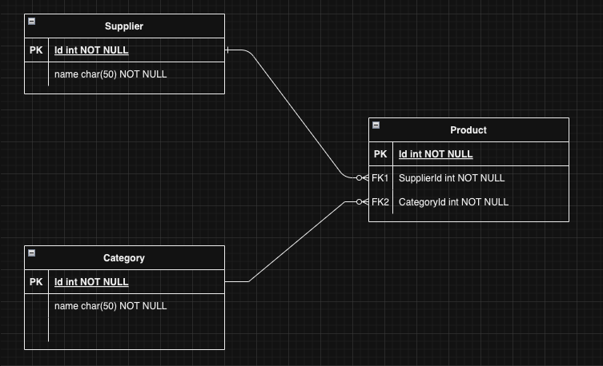

Requisitos Previos: "Antes de comenzar, asegúrate de tener instalado lo siguiente:"

- Visual Studio Code
  - Extensiones:
    - C# Dev Kit
    - C#
    - C# Extensions
    - SQLite
- .NET SDK 8.0.

## EntityFramework Core

Istalar los siguientes paquetes nuget

- Microsoft.EntityFrameworkCore
- Microsoft.EntityFrameworkCore.SqlServer
- Microsoft.EntityFrameworkCore.Sqlite
- Microsoft.EntityFrameworkCore.Design
- Microsoft.EntityFrameworkCore.Tools
- Microsoft.VisualStudio.Web.CodeGeneration.Design

Herramienta de EFCore para linea de comandos

- dotnet ef `dotnet tool install --global dotnet-ef`

<br/>
<br/>
<br/>
<br/>
<br/>
<br/>
<br/>
<br/>

<br/>
<br/>
<br/>
<br/>

## Connection String

- SqlServer

```json
 "ConnectionStrings": {
    "DefaultConnection": "Server=localhost,1433;Database=WebAppMVC;User=sa;Password=Password12$;TrustServerCertificate=true;MultipleActiveResultSets=true"
    }
```

- Sqlite

``` json
"ConnectionStrings":{
    "DefaultConnection":"Data Source = NameDB.db"
  },
```

<br/>
<br/>
<br/>
<br/>
<br/>
<br/>
<br/>
<br/>

<br/>
<br/>
<br/>
<br/>

## Diagram ER



<br/>
<br/>
<br/>
<br/>

## Models

``` C#
    public class Supplier
    {
        public int Id { get; set; }
        public string Name { get; set; }
        public List<Product> Products { get; set; }
    }
```

```C#
    public class Category
    {
        public int Id { get; set; }
        public string Name { get; set; }
        public string Description { get; set; }
        public List<Product> Products { get; set; }
    
    }
```

```C#
    public class Product
    {
        public int Id { get; set; }
        public string Name { get; set; }
        public string Description { get; set; }=string.Empty;
        public decimal Price { get; set; }
        public int CategoryId { get; set; }
        public Category? Category { get; set; }
        public int SupplierId { get; set; }
        public Supplier? Supplier { get; set; }

    }
```

## Migrations

    dotnet ef migrations add InitialCreate


    dotnet ef database update


## Datos para agergar a la BD

Category
```sql
INSERT INTO Categories (Id, Name, Description)
VALUES (1, 'Electronics', 'Category for electronic products');

INSERT INTO Categories (Id, Name, Description)
VALUES (2, 'Books', 'Category for various types of books');

INSERT INTO Categories (Id, Name, Description)
VALUES (3, 'Clothing', NULL);
```

Supplier
```sql
INSERT INTO Suppliers (Id, Name)
VALUES (1, 'Tech Supplies Co.');

INSERT INTO Suppliers (Id, Name)
VALUES (2, 'Book World Distributors');

INSERT INTO Suppliers (Id, Name)
VALUES (3, 'Fashion Hub Suppliers');

```
Product
```sql
INSERT INTO Products (Id, Name, Description, Price, CategoryId, SupplierId)
VALUES (1, 'Smartphone', 'Latest model smartphone with high-end features', 699.99, 1, 1);

INSERT INTO Products (Id, Name, Description, Price, CategoryId, SupplierId)
VALUES (2, 'E-book Reader', 'Portable e-book reader with high-resolution display', 129.99, 2, 2);

INSERT INTO Products (Id, Name, Description, Price, CategoryId, SupplierId)
VALUES (3, 'Leather Jacket', 'Premium leather jacket in various sizes', 199.99, 3, 3);

```

## Agregar controller con ASP-CodeGenerator

    dotnet tool uninstall -g dotnet-aspnet-codegenerator
    dotnet tool install -g dotnet-aspnet-codegenerator


Comando para ProductsController

    dotnet aspnet-codegenerator controller -name ProductsController -m Product -dc DataContext --relativeFolderPath Controllers --useDefaultLayout --referenceScriptLibraries

 - `-name ProductsController`: Define el nombre del controlador.
 - `-m Product`: Especifica que el controlador trabajará con el modelo Product.
 - `-dc DataContext`: Indica el contexto de datos a utilizar.
 - `--relativeFolderPath Controllers`: Define la ubicación del controlador.
 - `--useDefaultLayout`: Usa el layout por defecto para las vistas.
 - `--referenceScriptLibraries`: Añade referencias a las bibliotecas de scripts necesarias en las vistas.


## SweetAlert2
vamos agregar el siguiente link en nuestro layout.

    <script src="https://cdn.jsdelivr.net/npm/sweetalert2@11"></script>


```js
function showConfirmAcctionEdit(e,id) {
    e.preventDefault();
    //'Sure you want to delete the record?'
    Swal.fire({
        title: 'Sure you want to edit the record?',
        icon: 'question',
        showCancelButton: true,
        confirmButtonText: 'Yes'
    }).then((resultado) => {
        if (resultado.isConfirmed) {
            window.location.href = `/Products/Edit/${id}`;
        }
    })
}

function showConfirmAcctionDelete(e, id) {
    e.preventDefault();
    //'Sure you want to delete the record?'
    Swal.fire({
        title: 'Sure you want to delete the record?',
        icon: 'question',
        showCancelButton: true,
        confirmButtonText: 'Yes'
    }).then((resultado) => {
        if (resultado.isConfirmed) {
            window.location.href = `/Products/Delete/${id}`;
        }
    })
}


```


